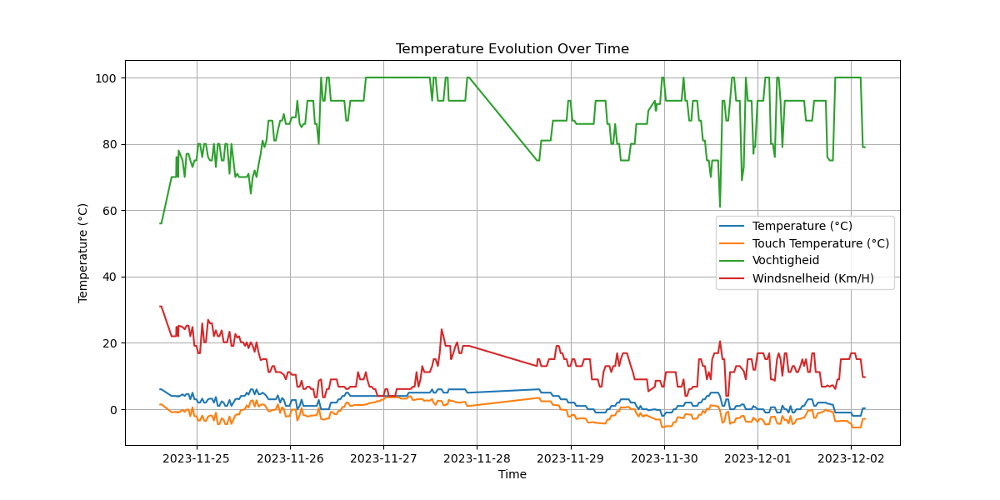

# Data Analyse Rapport

## Inleiding

Dit rapport geeft een samenvatting van de resultaten van de data-analyse uitgevoerd op [datum]. De analyse omvatte grafieken en statistieken die relevant zijn voor [onderwerp].

## Analyse Resultaten

### Grafiek 1: [Beschrijving]

_Opmerking: Voeg hier eventuele interpretaties en inzichten toe._

### Tabel 1: Statistieken

| Statistiek | Temperatuur | GevoelsTemperatuur | Vochtigheid | Windsnelheid |
| ---------- | ----------- | ------------------ | ----------- | ------------ |
| Gemiddelde | [Waarde]    |                    |             |              |
| Min        | [Waarde]    |                    |             |              |
| Max        | [Waarde]    |                    |             |              |

_Opmerking: Bespreek de belangrijkste bevindingen op basis van de statistieken._

## Aanbevelingen

Op basis van de analyse raden we de volgende acties aan:

- [Aanbeveling 1]
- [Aanbeveling 2]

## Automatisering Script

Een deel van het rapport is gegenereerd met behulp van een automatiseringsscript op [scriptdatum]. Het script heeft geholpen bij het invoegen van grafieken en statistieken in dit Markdown-bestand.

## Conclusie

Dit rapport biedt een overzicht van de resultaten van de data-analyse. Verdere interpretatie en acties zijn gebaseerd op de expertise van de data scientist.

_Laatst bijgewerkt op [timestamp]._
